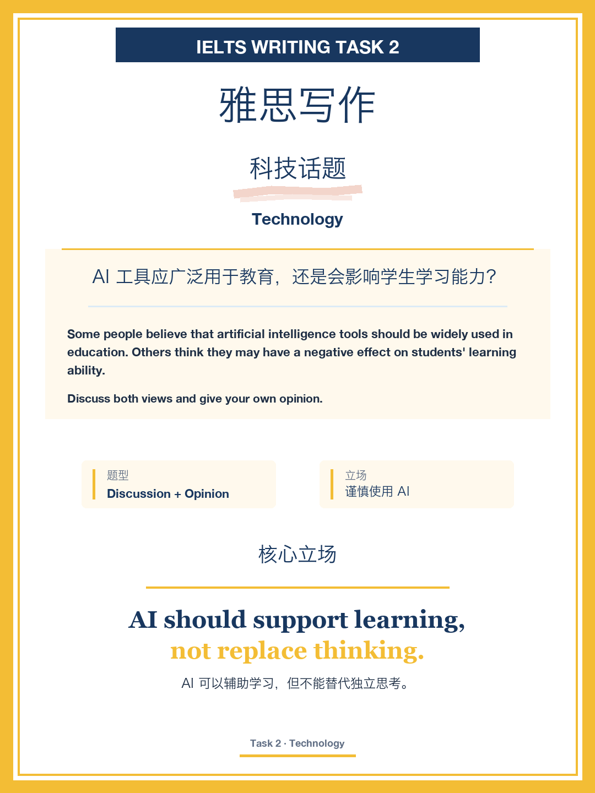
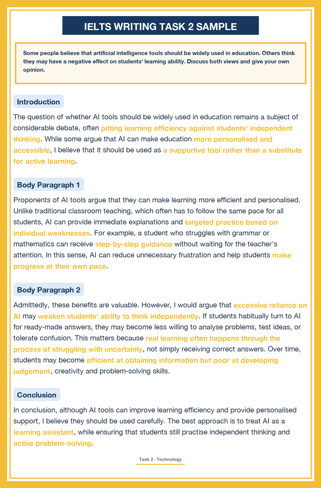
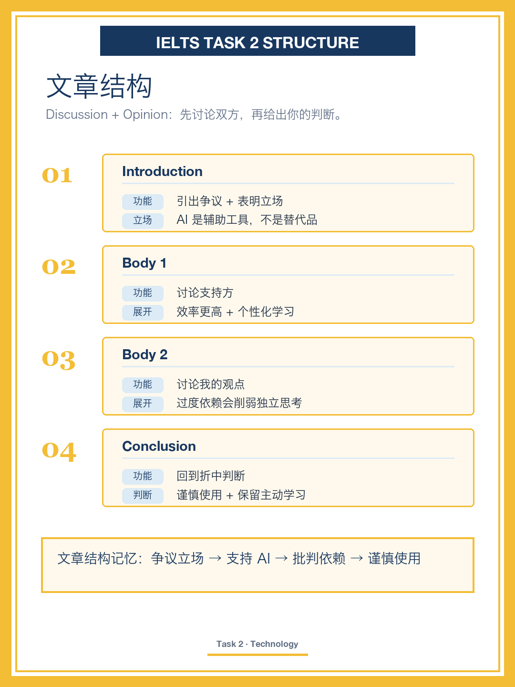
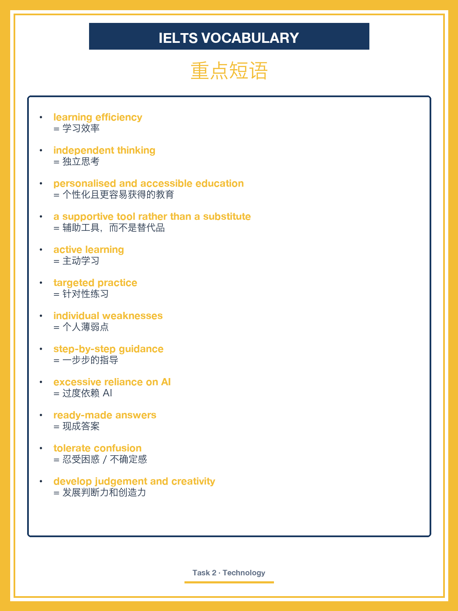
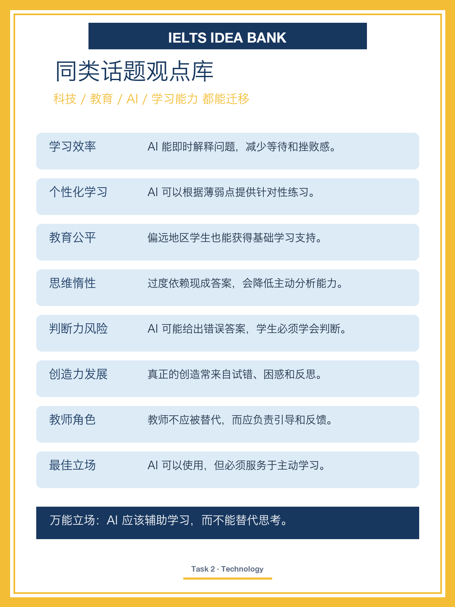

# IELTS Writing Task 2｜AI Tools in Education

## Question

Some people believe that artificial intelligence tools should be widely used in education. Others think they may have a negative effect on students' learning ability.

Discuss both views and give your own opinion.

## 中文题目

有人认为 AI 工具应该广泛用于教育。另一些人认为它们可能会影响学生的学习能力。讨论双方观点并给出你的看法。

## Core Stance

AI should be a supportive tool rather than a substitute for active learning.

AI 可以辅助学习，但不能替代主动思考。

## Band 8 Sample Essay

The question of whether AI tools should be widely used in education remains a subject of considerable debate, often pitting learning efficiency against students' independent thinking. While some argue that AI can make education more personalised and accessible, I believe that it should be used as a supportive tool rather than a substitute for active learning.

Proponents of AI tools argue that they can make learning more efficient and personalised. Unlike traditional classroom teaching, which often has to follow the same pace for all students, AI can provide immediate explanations and targeted practice based on individual weaknesses. For example, a student who struggles with grammar or mathematics can receive step-by-step guidance without waiting for the teacher's attention. In this sense, AI can reduce unnecessary frustration and help students make progress at their own pace.

Admittedly, these benefits are valuable. However, I would argue that excessive reliance on AI may weaken students' ability to think independently. If students habitually turn to AI for ready-made answers, they may become less willing to analyse problems, test ideas, or tolerate confusion. This matters because real learning often happens through the process of struggling with uncertainty, not simply receiving correct answers. Over time, students may become efficient at obtaining information but poor at developing judgement, creativity and problem-solving skills.

In conclusion, although AI tools can improve learning efficiency and provide personalised support, I believe they should be used carefully. The best approach is to treat AI as a learning assistant, while ensuring that students still practise independent thinking and active problem-solving.

## 全文翻译

AI 工具是否应广泛用于教育，一直是一个颇具争议的话题，它常常把学习效率和学生的独立思考对立起来。虽然有人认为 AI 能让教育更个性化、更易获得，但我认为它应当作为辅助工具，而不是主动学习的替代品。

支持 AI 工具的人认为，它能让学习更高效、更个性化。与常常必须让所有学生保持同一进度的传统课堂教学不同，AI 能根据每个人的薄弱点提供即时讲解和针对性练习。例如，一个在语法或数学上有困难的学生，无需等待老师关注就能获得一步步的指导。从这个意义上说，AI 能减少不必要的挫败感，帮助学生按自己的节奏进步。

诚然，这些好处很有价值。然而，我认为过度依赖 AI 可能会削弱学生独立思考的能力。如果学生习惯性地向 AI 索取现成答案，他们可能会变得不太愿意分析问题、检验想法或忍受困惑。这一点很重要，因为真正的学习往往发生在与不确定性搏斗的过程中，而不仅仅是接收正确答案。久而久之，学生可能善于获取信息，却不擅长培养判断力、创造力和解决问题的能力。

总之，尽管 AI 工具能提升学习效率、提供个性化支持，但我认为应谨慎使用。最好的做法是把 AI 当作学习助手，同时确保学生仍然练习独立思考和主动解决问题。

## 文章结构

| Paragraph | Function | Main Point |
|---|---|---|
| Introduction | 引出争议 + 表明立场 | AI 是辅助工具，不是替代品 |
| Body 1 | 讨论支持方 | 效率更高 + 个性化学习 |
| Body 2 | 讨论我的观点 | 过度依赖会削弱独立思考 |
| Conclusion | 回到折中判断 | 谨慎使用 + 保留主动学习 |

文章结构记忆：争议立场 → 支持 AI → 批判依赖 → 谨慎使用

## 重点短语

| Phrase | 中文 |
|---|---|
| learning efficiency | 学习效率 |
| independent thinking | 独立思考 |
| personalised and accessible | 个性化且更易获得的 |
| a supportive tool rather than a substitute | 辅助工具，而不是替代品 |
| active learning | 主动学习 |
| targeted practice | 针对性练习 |
| individual weaknesses | 个人薄弱点 |
| step-by-step guidance | 一步步的指导 |
| excessive reliance on AI | 过度依赖 AI |
| ready-made answers | 现成答案 |
| tolerate confusion | 忍受困惑 / 不确定感 |
| developing judgement, creativity and problem-solving skills | 发展判断力、创造力与解决问题的能力 |

## 同义替换

| 意义 | 同义表达 |
|---|---|
| 认为 / 主张 | argue, contend, believe, maintain |
| 提升 / 改善 | improve, enhance, boost |
| 削弱 | weaken, undermine, erode |
| 依赖 | reliance on, dependence on, turn to |
| 帮助 | help, assist, support, aid |
| 减少 | reduce, lessen, cut down |

## 得分点

| 维度 | 这篇的体现 |
|---|---|
| Task Response 任务回应 | 讨论 AI 支持与反对两面，先承认好处（Admittedly）再提出"辅助而非替代"的核心立场，观点前后一致 |
| Coherence & Cohesion 连贯衔接 | Unlike / For example / In this sense / However / Over time / In conclusion 让论证层层推进 |
| Lexical Resource 词汇 | learning efficiency、targeted practice、tolerate confusion、developing judgement 等表达；argue / contend、improve / enhance 同义替换 |
| Grammatical Range 语法 | 定语从句（which often has to follow…）、条件句（If students…）、让步（although）、动名词并列，句式丰富准确 |

## 观点库

- 学习效率：AI 能即时解释问题，减少等待和挫败感。
- 个性化学习：AI 可以根据薄弱点提供针对性练习。
- 教育公平：偏远地区学生也能获得基础学习支持。
- 思维惰性：过度依赖现成答案，会降低主动分析能力。
- 判断力风险：AI 可能给出错误答案，学生必须学会判断。
- 创造力发展：真正的创造常来自试错、困惑和反思。
- 教师角色：教师不应被替代，而应负责引导和反馈。
- 最佳立场：AI 可以使用，但必须服务于主动学习。

## 图片

