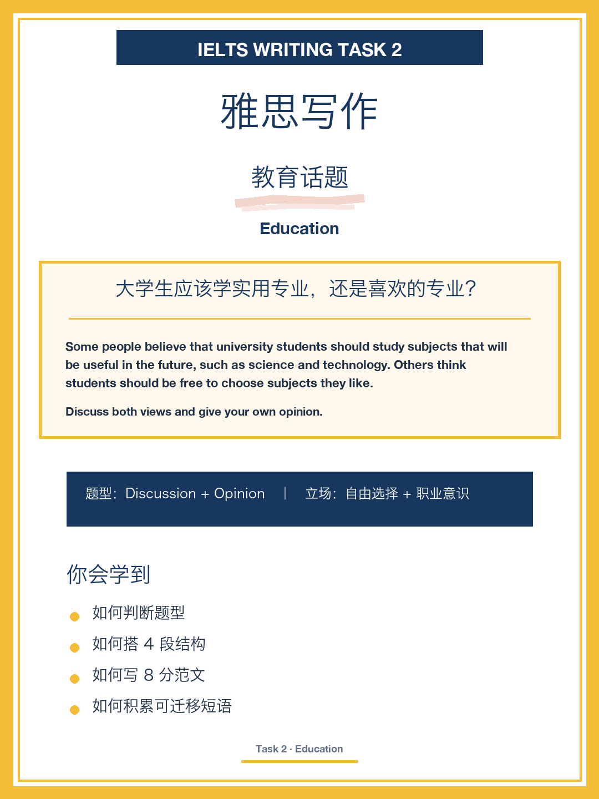
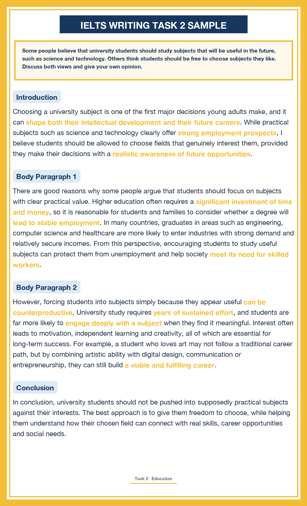
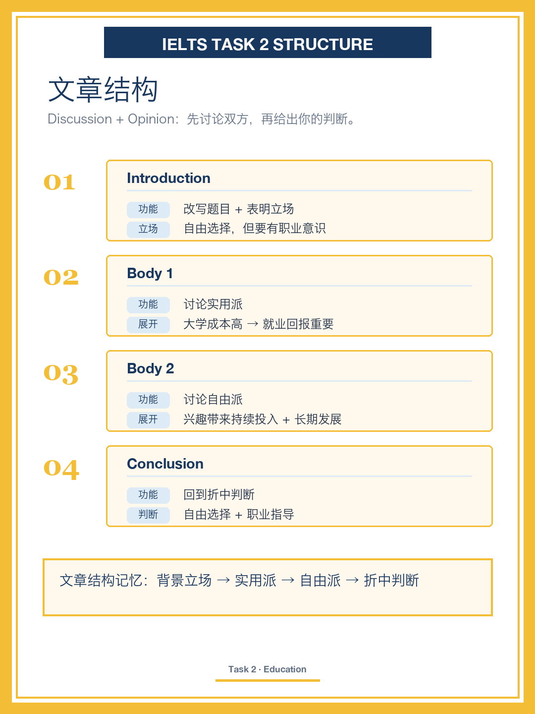
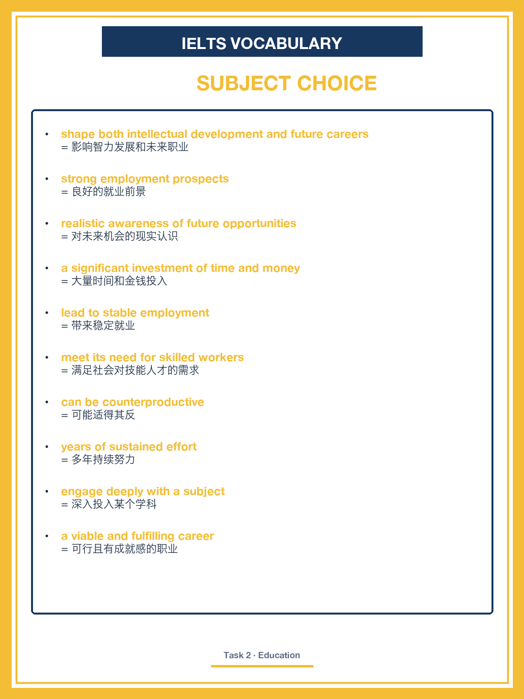
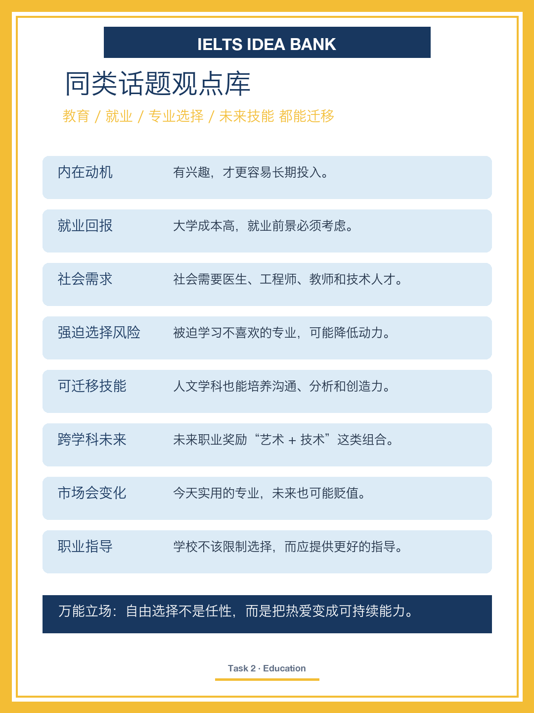

# IELTS Writing Task 2｜Subject Choice at University

## Question

Some people believe that university students should study subjects that will be useful in the future, such as science and technology. Others think students should be free to choose subjects they like.

Discuss both views and give your own opinion.

## 中文题目

大学生应该学习科学技术等未来"有用"的学科，还是自由选择自己喜欢的学科？

## Core Stance

Students should have freedom to choose, but that freedom should be guided by realistic career awareness.

应该自由选择，但这份自由要建立在对职业前景的现实认知上。

## Band 8 Sample Essay

Choosing a university subject is one of the first major decisions young adults make, and it can shape both their intellectual development and their future careers. While practical subjects such as science and technology clearly offer strong employment prospects, I believe students should be allowed to choose fields that genuinely interest them, provided they make their decisions with a realistic awareness of future opportunities.

There are good reasons why some people argue that students should focus on subjects with clear practical value. Higher education often requires a significant investment of time and money, so it is reasonable for students and families to consider whether a degree will lead to stable employment. In many countries, graduates in areas such as engineering, computer science and healthcare are more likely to enter industries with strong demand and relatively secure incomes. From this perspective, encouraging students to study useful subjects can protect them from unemployment and help society meet its need for skilled workers.

However, forcing students into subjects simply because they appear useful can be counterproductive. University study requires years of sustained effort, and students are far more likely to engage deeply with a subject when they find it meaningful. Interest often leads to motivation, independent learning and creativity, all of which are essential for long-term success. For example, a student who loves art may not follow a traditional career path, but by combining artistic ability with digital design, communication or entrepreneurship, they can still build a viable and fulfilling career.

In conclusion, university students should not be pushed into supposedly practical subjects against their interests. The best approach is to give them freedom to choose, while helping them understand how their chosen field can connect with real skills, career opportunities and social needs.

## 文章结构

| Paragraph | Function | Main Point |
|---|---|---|
| Introduction | 引出争议 + 表明立场 | 自由选择，但要有现实认知 |
| Body 1 | 讨论实用派 | 教育投入大，实用学科就业稳 |
| Body 2 | 讨论兴趣派（我方） | 兴趣带来动力、深入与创造力 |
| Conclusion | 回到引导式自由 | 自由选择 + 职业引导 |

文章结构记忆：争议立场 → 实用价值 → 兴趣动力 → 引导自由

## 重点短语

| Phrase | 中文 |
|---|---|
| shape both their intellectual development and their future careers | 塑造智识发展与未来职业 |
| offer strong employment prospects | 就业前景好 |
| with a realistic awareness of future opportunities | 对未来机会有现实认知 |
| a significant investment of time and money | 时间和金钱的大量投入 |
| lead to stable employment | 带来稳定就业 |
| meet its need for skilled workers | 满足社会对技术人才的需求 |
| can be counterproductive | 可能适得其反 |
| years of sustained effort | 多年的持续投入 |
| engage deeply with a subject | 深入投入一门学科 |
| a viable and fulfilling career | 可行且有成就感的职业 |

## 观点库

- 内在动机：发自内心的兴趣带来更深入的学习。
- 就业考量：大学花费高昂，职业前景确实重要。
- 社会需求：社会需要医生、工程师、教师和技术人员。
- 强迫风险：被迫学不喜欢的学科会削弱学习动力。
- 可迁移技能：非职业导向的学科同样能培养有用能力。
- 跨界未来：现代职业常常是多个领域的结合。
- 市场变化：今天"有用"的学科将来未必吃香。
- 最佳立场：大学应提供职业引导，而不是限制选择。

## 图片

