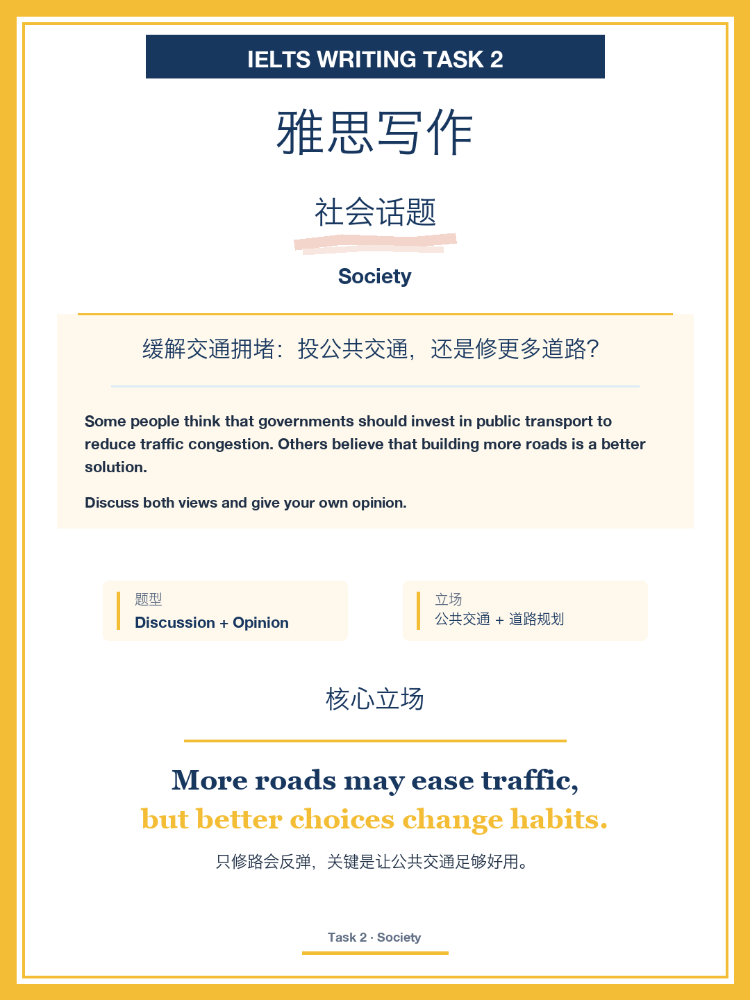
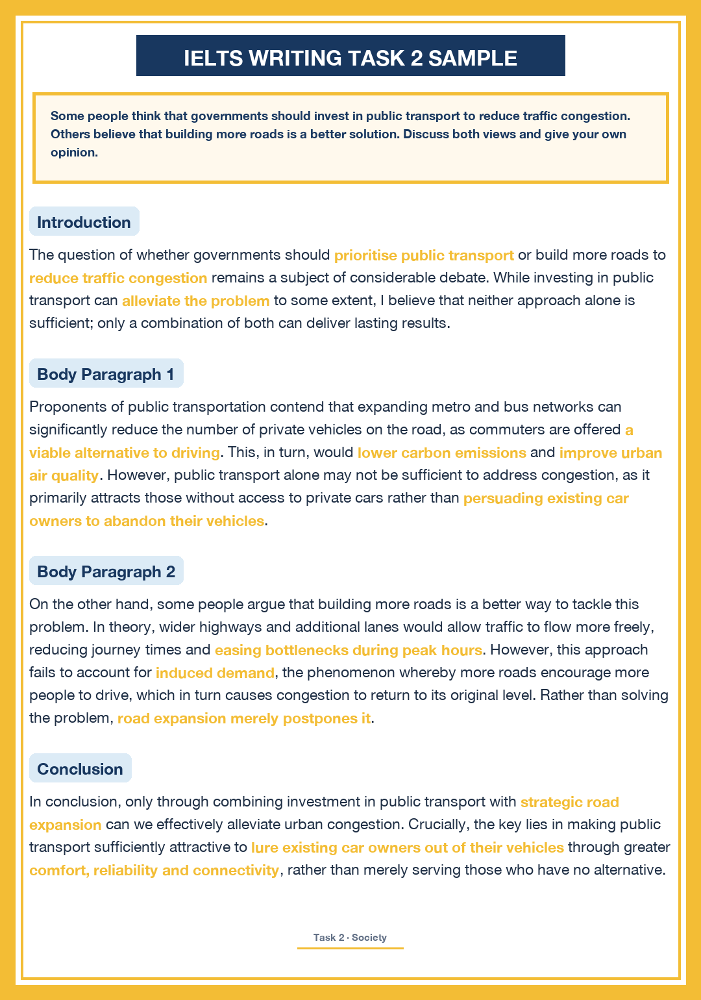
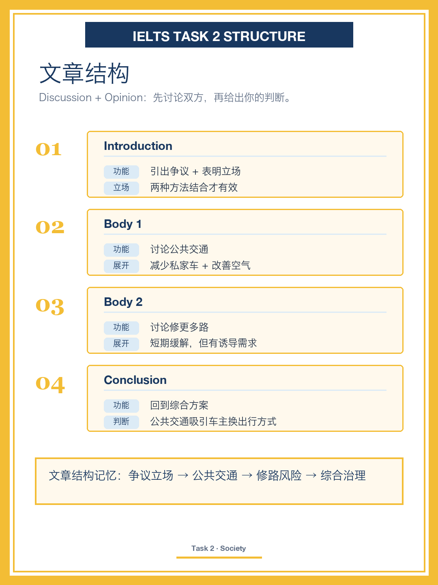
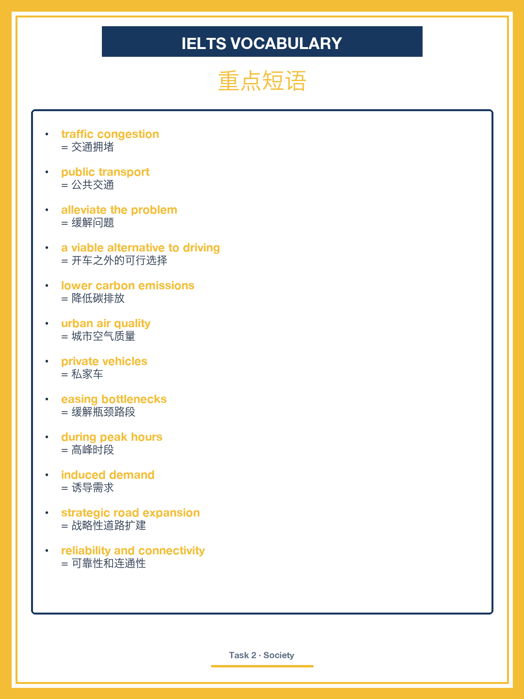
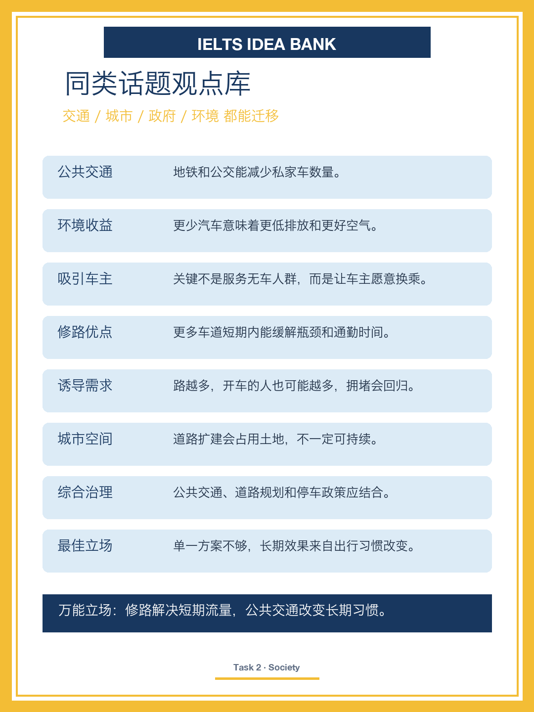

# IELTS Writing Task 2｜Traffic Congestion

## Question

Some people think that governments should invest in public transport to reduce traffic congestion. Others believe that building more roads is a better solution.

Discuss both views and give your own opinion.

## 中文题目

缓解交通拥堵：投公共交通，还是修更多道路？

## Core Stance

More roads may ease traffic, but better choices change habits.

只修路会反弹，关键是让公共交通足够好用。

## Band 8 Sample Essay

The question of whether governments should prioritise public transport or build more roads to reduce traffic congestion remains a subject of considerable debate. While investing in public transport can alleviate the problem to some extent, I believe that neither approach alone is sufficient; only a combination of both can deliver lasting results.

Proponents of public transportation contend that expanding metro and bus networks can significantly reduce the number of private vehicles on the road, as commuters are offered a viable alternative to driving. This, in turn, would lower carbon emissions and improve urban air quality. However, public transport alone may not be sufficient to address congestion, as it primarily attracts those without access to private cars rather than persuading existing car owners to abandon their vehicles.

On the other hand, some people argue that building more roads is a better way to tackle this problem. In theory, wider highways and additional lanes would allow traffic to flow more freely, reducing journey times and easing bottlenecks during peak hours. However, this approach fails to account for induced demand, the phenomenon whereby more roads encourage more people to drive, which in turn causes congestion to return to its original level. Rather than solving the problem, road expansion merely postpones it.

In conclusion, only through combining investment in public transport with strategic road expansion can we effectively alleviate urban congestion. Crucially, the key lies in making public transport sufficiently attractive to lure existing car owners out of their vehicles through greater comfort, reliability and connectivity, rather than merely serving those who have no alternative.

## 文章结构

| Paragraph | Function | Main Point |
|---|---|---|
| Introduction | 引出争议 + 表明立场 | 两种方法结合才有效 |
| Body 1 | 讨论公共交通 | 减少私家车 + 改善空气 |
| Body 2 | 讨论修更多路 | 短期缓解，但有诱导需求 |
| Conclusion | 回到综合方案 | 公共交通吸引车主换出行方式 |

文章结构记忆：争议立场 → 公共交通 → 修路风险 → 综合治理

## 重点短语

| Phrase | 中文 |
|---|---|
| traffic congestion | 交通拥堵 |
| public transport | 公共交通 |
| alleviate the problem | 缓解问题 |
| a viable alternative to driving | 开车之外的可行选择 |
| lower carbon emissions | 降低碳排放 |
| urban air quality | 城市空气质量 |
| private vehicles | 私家车 |
| easing bottlenecks | 缓解瓶颈路段 |
| during peak hours | 高峰时段 |
| induced demand | 诱导需求 |
| strategic road expansion | 战略性道路扩建 |
| reliability and connectivity | 可靠性和连通性 |

## 观点库

- 公共交通：地铁和公交能减少私家车数量。
- 环境收益：更少汽车意味着更低排放和更好空气。
- 吸引车主：关键不是服务无车人群，而是让车主愿意换乘。
- 修路优点：更多车道短期内能缓解瓶颈和通勤时间。
- 诱导需求：路越多，开车的人也可能越多，拥堵会回归。
- 城市空间：道路扩建会占用土地，不一定可持续。
- 综合治理：公共交通、道路规划和停车政策应结合。
- 最佳立场：单一方案不够，长期效果来自出行习惯改变。

## 图片

